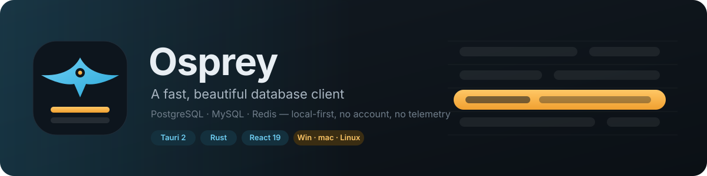
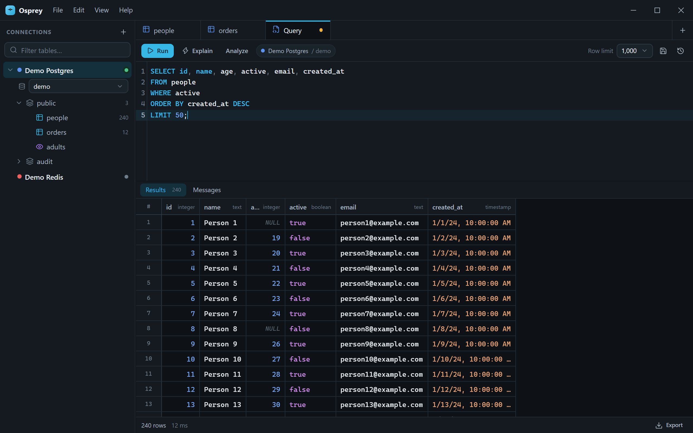
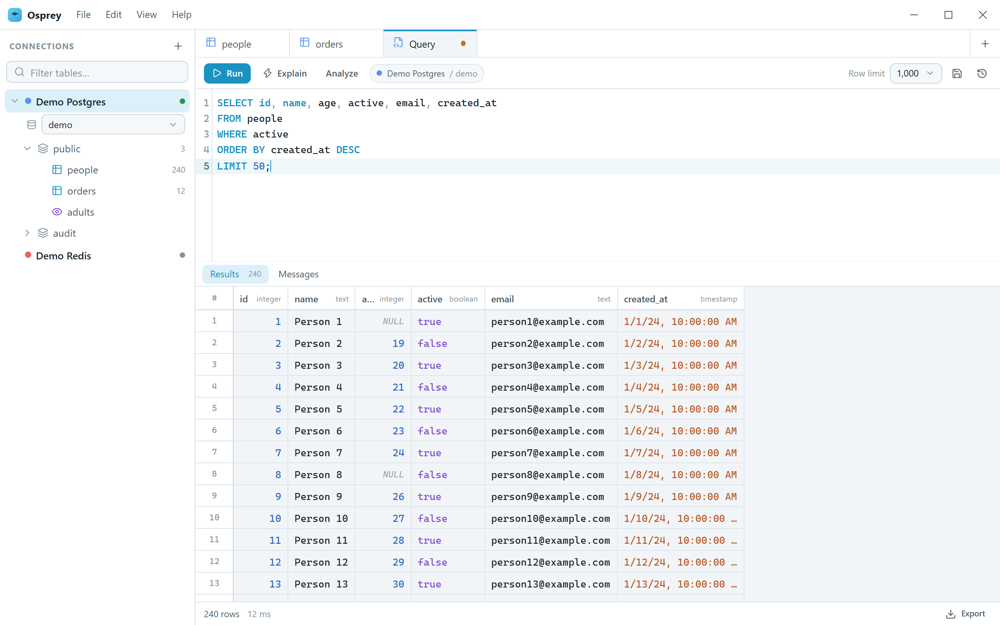
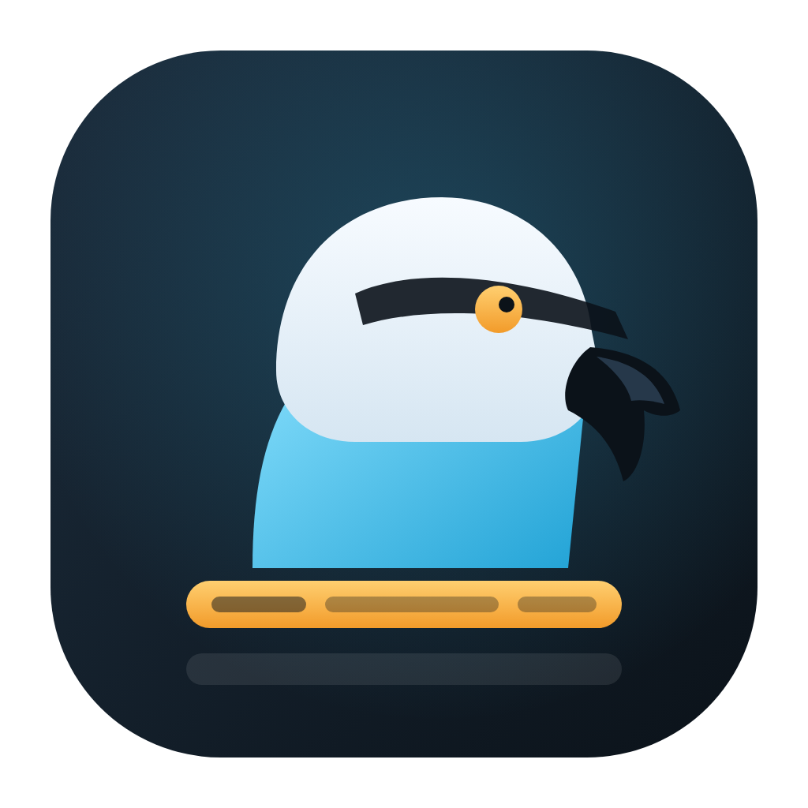

<p align="center">
  
</p>

<p align="center">
  <a href="https://github.com/lbss9/osprey/blob/main/LICENSE"></a>
  
  
  
  
  
  <a href="https://github.com/lbss9/osprey/releases/latest"></a>
</p>

<p align="center">
  <a href="#install">Install</a> ·
  <a href="#features">Features</a> ·
  <a href="#databases">Databases</a> ·
  <a href="#keyboard">Keyboard</a> ·
  <a href="#architecture">Architecture</a> ·
  <a href="#building-from-source">Build</a> ·
  <a href="#roadmap">Roadmap</a>
</p>

Osprey is a desktop database client that gets out of the way. It opens in under a second, keeps
every connection on your disk, and lets someone who has never written SQL browse, filter and edit a
table safely. PostgreSQL, MySQL/MariaDB and Redis today; more engines later. The engine is Rust,
the shell is Tauri 2, and the interface is React with its own identity.

<p align="center">
  
</p>
<p align="center">
  
  &nbsp;
  
</p>

## Why another database client

- **Local-first.** Connections, query history and settings live in a SQLite file in your app data
  folder. Passwords go to the OS credential store (Keychain, Credential Manager, Secret Service).
  No account, no sync, no telemetry.
- **Fast by design.** Filters, sorting and paging run on the server; the grid is virtualized in
  both directions; Redis is browsed with `SCAN`, never `KEYS`. A million-row table feels the same
  as a hundred-row one.
- **Safe by default.** Nothing is written until you press *Apply* and read the exact SQL that
  will run, inside one transaction. Rows without a primary key are read-only. A connection can be
  marked read-only for good.
- **Built to be looked at.** Frameless window, dark and light themes, colours per data type,
  monospace data, no borrowed UI patterns.

## Features

**Connections**

- PostgreSQL, MySQL/MariaDB, Redis, SQLite, ClickHouse and SQL Server with one dialog: host, port, user,
  password, database, TLS mode (off / prefer / require / verify), colour, group and read-only flag
- The database field is optional: leave it empty and Osprey lands on the server's maintenance
  database (`postgres`, `master`, `default`, or no default schema on MySQL) and lists every
  database in the sidebar, the way pgAdmin, DBeaver and TablePlus do
- SSH tunnel per connection (password or private key), opened before the driver connects
- *Test* connects once and shows the server version before you save
- Right-click any connection, schema or table for a full context menu; *Properties…* edits the
  connection in place; drag connections to reorder them
- Sidebar tree: connection → database → schema → tables and views with row estimates, plus a
  quick filter. Switch database (PostgreSQL) or DB index (Redis) in place

**Data tab**

- Server-side paging, sorting and no-code filters (`contains`, `is empty`, `is one of`…) with an
  optional free-form `WHERE`
- Inline editing: type into a cell, add rows, delete rows. Changes stay pending (amber, green, red)
  until you *Preview SQL* and *Apply*; everything runs in a single transaction
- Right-click: copy value, copy row as JSON / CSV / `INSERT`, filter by this value, set `NULL` or
  `DEFAULT`
- Export the page as CSV, JSON or SQL inserts; copy a selection as TSV

**Query tab**

- CodeMirror 6 editor with the PostgreSQL, MySQL or SQLite dialect and autocompletion for schemas,
  tables and columns (the column list is fetched once per schema)
- Results stream in while the statement runs: the first rows appear immediately and a long
  query can be cancelled with what has arrived so far kept on screen
- *Explain* and *Analyze* render the plan as a tree (PostgreSQL JSON plans, MySQL JSON / ANALYZE, SQLite query plan)
- Saved queries with names, and a command palette (`Ctrl+K`) that opens any table, query or action by name
- `Ctrl+Enter` runs the selection or everything; several statements per run, one result set per
  statement, messages with row counts and timings
- Cancel a running statement, cap the row count, browse the history panel

**Structure tab**

- Columns with types, nullability, defaults and comments; indexes; foreign keys you can click to
  open the referenced table; `SHOW CREATE TABLE` on MySQL
- Create tables, add / alter / drop columns, create indexes, rename, truncate and drop, always with
  the generated DDL shown before it runs
- ER diagram per schema: tables as cards, foreign keys as links, drag to arrange, export as SVG
- Import a CSV into an existing or a new table (delimiter and header detection, batched inserts in
  one transaction)

**Redis**

- Key browser with pattern and type filter, grouped by namespace (`user:1:profile` → `user` › `1`)
- Value editor for strings, hashes, lists, sets, sorted sets and streams, with paging for big
  collections; TTL, rename and delete
- Console for any command with the reply shown as JSON; `INFO` dashboard
- Tools tab: slow log, memory usage grouped by key prefix, and a pub/sub monitor with publish

**Everywhere**

- Interface in English and Brazilian Portuguese; dark, light or follow-the-system theme, plus
  JSON themes dropped into the themes folder (live reload, export the current one as a starting point)
- Numbers and dates in grids follow the locale you pick; copying and editing keep the raw value
- Drag tabs to reorder them; every visible string is translatable
- Signed in-app updates on Windows, macOS and Linux

## Databases

| Engine | Driver | Status |
| --- | --- | --- |
| PostgreSQL 12+ | `tokio-postgres` (text protocol for results, extended for the catalog) | supported |
| MySQL 8 / MariaDB 10+ | `mysql_async` (small pool, text protocol) | supported, tested on MySQL 8.4 and MariaDB 11 |
| Redis 6+ | `redis` (`ConnectionManager`, RESP2/3) | supported |
| SQLite 3 | `rusqlite` (bundled) | supported |
| ClickHouse 22.8+ | HTTP interface via `reqwest` (JSONCompact) | supported |
| SQL Server 2008+ / Azure SQL | `tiberius` (TDS, rustls) | supported |
| MongoDB, DuckDB | — | planned |

TLS uses `rustls`. *Prefer* and *Require* encrypt without checking the certificate (what most
clients do); *Verify* checks it against the operating system's trust store.

## Keyboard

| | |
| --- | --- |
| `Ctrl+N` | New connection |
| `Ctrl+T` / `Ctrl+W` | New query tab / close tab |
| `Ctrl+Tab` | Next tab |
| `Ctrl+Enter`, `F5` | Run query (selection or all) |
| `Ctrl+R` | Refresh the current tab |
| `Ctrl+B` | Toggle sidebar |
| `Ctrl+,` | Settings |
| `Ctrl+=` / `Ctrl+-` / `Ctrl+0` | Zoom |
| Grid: `Enter` / `F2` | Edit cell · `Esc` cancel · `Tab` next cell · `Delete` set NULL · `Ctrl+C` copy |

On macOS `Ctrl` is `⌘`.

## Architecture

```
┌──────────────────────────── WebView (React + TypeScript) ────────────────────────────┐
│  pages/App.tsx                                                                        │
│  components/  atoms → molecules → organisms → templates   (DataGrid, SqlEditor…)      │
│  store/       zustand: ui (persisted prefs) · workspace (sessions, schema cache, tabs) │
│  services/    tauri.ts (invoke wrappers) · updater.ts                                 │
└───────────────────────────────────────┬───────────────────────────────────────────────┘
                                        │ tauri::command
┌───────────────────────────────────────▼─────────────────── Rust (src-tauri) ─────────┐
│  commands/   thin adapters: connections · sessions · schema · query · table · redis   │
│  drivers/    SqlDriver trait → postgres · mysql · sqlite · clickhouse · mssql;          │
│              RedisSession; ssh.rs tunnels; sql.rs (dialects,                            │
│              filters, paging, UPDATE/INSERT/DELETE from pending edits)                │
│  store/      SQLite (WAL) via rusqlite: connections · history · saved queries         │
│  secrets.rs  keyring → OS credential store       error.rs: `errors.<key>|detail`      │
└───────────────────────────────────────────────────────────────────────────────────────┘
```

| Layer | Stack |
| --- | --- |
| Shell | Tauri 2 (WebView2 / WKWebView / WebKitGTK) |
| Drivers | `tokio-postgres`, `mysql_async`, `redis`, `rustls` |
| Storage | SQLite in WAL mode via `rusqlite`; passwords via `keyring` |
| UI | React 19, TypeScript 5, Vite 7, `zustand`, `lucide-react` |
| Grid & editor | custom virtualized grid on `@tanstack/react-virtual`; CodeMirror 6 + `lang-sql` |
| i18n | `react-i18next`, `en` and `pt-BR` |

Errors cross the bridge as `errors.<key>|detail` strings and are translated on the frontend, so
the Rust side never carries user-facing text.

## Install

Grab the latest build from the [releases page](https://github.com/lbss9/osprey/releases/latest):

| Platform | File |
| --- | --- |
| Windows 10/11 | `Osprey_x.y.z_x64-setup.exe` (per-user, no admin prompt) or the `.msi` |
| macOS 11+ | `Osprey_x.y.z_aarch64.dmg` (Apple Silicon) or `Osprey_x.y.z_x64.dmg` (Intel) |
| Linux x64 | `.AppImage`, `.deb` or `.rpm` |

Installed copies check the releases page on startup and offer to update in place; you can also
check from *Settings → About*. Every update package is signed and verified before it is applied.

### macOS: "Osprey can't be opened" / "developer cannot be verified"

The macOS builds are not signed with an Apple Developer certificate and are not notarized
(there is no paid developer account behind the project). Gatekeeper therefore shows one of these
messages the first time you open the app:

> "Osprey" can't be opened because Apple cannot check it for malicious software.
> "Osprey" is damaged and can't be opened. You should move it to the Bin.

The app is fine; the message is only about the missing signature. Pick one of these:

1. Copy Osprey to *Applications*, then **right-click (or Control-click) the app → Open → Open**.
   macOS remembers the choice and the warning does not come back.
2. Or clear the quarantine flag once from Terminal:

```bash
xattr -cr /Applications/Osprey.app
```

3. On macOS 13 or newer, if the dialog has no *Open* button, go to *System Settings → Privacy &
   Security*, scroll to the message about Osprey and click **Open Anyway**.

The in-app updater downloads the new version and verifies its signature, but the quarantine flag
can make macOS refuse the replaced app on the next launch. If that happens, repeat step 2 with the
new version. Windows and Linux are not affected: their packages update in place without any prompt.

## Building from source

Requirements: Node.js 20+, a stable Rust toolchain, and the
[Tauri prerequisites](https://tauri.app/start/prerequisites/) for your platform (on Linux also
`libdbus-1-dev` for the credential store).

```bash
git clone https://github.com/lbss9/osprey.git
cd osprey
npm install
npm run tauri dev      # run with hot reload
npm run tauri build    # produce installers under src-tauri/target/release/bundle
npm run release -- 0.2.0   # bump versions, tag v0.2.0 and push (CI builds and publishes)
```

### Tests

| Layer | Command | What it covers |
| --- | --- | --- |
| Frontend types | `npx tsc --noEmit` | strict TypeScript over `src/` |
| Rust unit | `cargo test --manifest-path src-tauri/Cargo.toml` | SQL generation, quoting, console parsing |
| Drivers (live servers) | `OSPREY_TEST_PG=… OSPREY_TEST_MYSQL=… OSPREY_TEST_REDIS=… OSPREY_TEST_SSH=… cargo test --manifest-path src-tauri/Cargo.toml --test drivers -- --ignored` | catalog, paging, edits in a transaction, multi-statement, cancel, Redis types, slow log / memory / pub/sub, SSH tunnel; the SQLite case runs without any server |
| Visual (Playwright) | `npm run test:visual` | pixel snapshots of the main screens, per platform, opt-in |
| UI (Playwright) | `npm run test:e2e` | 24 specs: dialogs, context menus, grid editing and SQL preview, query editor, EXPLAIN, DDL editor, CSV import, Redis views and tools, JSON themes, drag-and-drop, locale formatting, settings |

The UI suite runs in Chromium against the Vite dev server with an in-memory stand-in for the
Rust backend (`src/dev/tauriMock.ts`, enabled by opening the app with `?mock=1`), so it needs
neither the native window nor a database. `npm run test:e2e:ui` opens Playwright's inspector.
CI runs the type check, unit, driver and UI layers on every push, with PostgreSQL, MySQL, Redis
and ClickHouse as service containers. Visual snapshots are opt-in because fonts differ per OS.

Your data lives in the app data folder (`%APPDATA%\com.lluan.osprey` on Windows,
`~/Library/Application Support/com.lluan.osprey` on macOS, `~/.local/share/com.lluan.osprey` on
Linux). *Settings → Data → Open folder* takes you there.

## Roadmap

- [x] Connections with OS keychain, groups, colours, read-only
- [x] Table browser with server-side filters, paging, batched edits and SQL preview
- [x] Query editor with autocompletion, multi-statement runs, cancel, history
- [x] Structure view (columns, indexes, foreign keys, DDL)
- [x] Redis browser, value editors, console, INFO
- [x] Signed auto-update for Windows, macOS and Linux
- [x] SSH tunnels
- [x] Command palette (open any table by name)
- [x] Saved queries
- [x] Table and column editing (DDL with preview)
- [x] Visual EXPLAIN
- [x] CSV import
- [x] SQLite
- [x] Redis slow log, memory by prefix, pub/sub
- [x] JSON themes
- [x] Streaming of very large results
- [x] ClickHouse
- [x] SQL Server
- [ ] MongoDB, DuckDB
- [x] ER diagram

## Contributing

Issues and pull requests are welcome. Keep the visual identity intact, follow the atomic design
layout under `src/components`, write code comments in English, and run `npx tsc --noEmit` and
`cargo test` before opening a PR.

## License

[MIT](LICENSE) © Luan Barbosa
